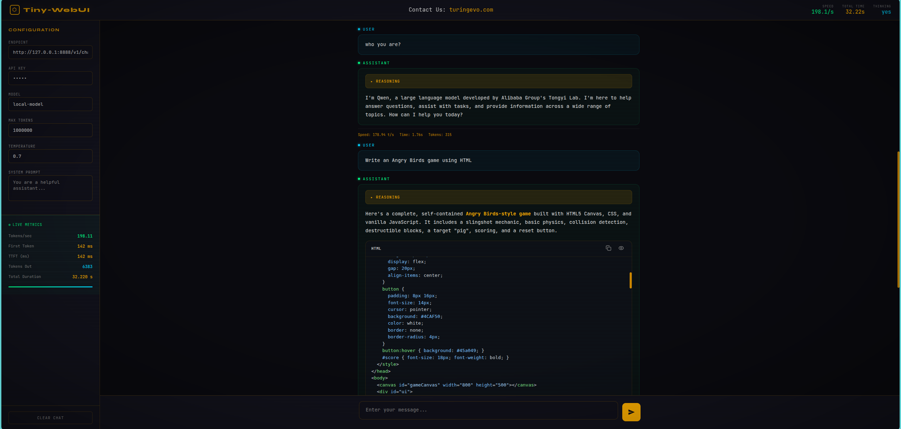

# tiny-webui
### A single file that implements OpenAI-compatible web UI

### ● Summary of Functions in tiny-webui.html 
This is a single-file HTML chat interface (1540 lines), which connects to the OpenAI-compatible API endpoint via SSE in a streaming manner (default http://127.0.0.1:8888/v1/chat/completions), and is specifically designed for local large language model inference services (such as the OpenAI API server). 
Main functional modules 
1. Layout and Visuals
- Dark terminal theme with CRT scanline effect
- Fixed top bar (displaying speed, duration, Thinking status) + Left configuration panel (280px) + Right chat area
- Equal-width font (e.g. JetBrains Mono), color scheme of amber/teal/green
- Responsive design (sidebar hidden on mobile devices) 
2. Configuration Panel
- API Endpoint, API Key, Model Name, Max Tokens, Temperature, System Prompt
- Real-time Performance Indicators: Tokens/sec, First Token Time (TTFT), Output Tokens, Total Duration, Progress Bar
- CLEAR CHAT Button 
3. Chat Function
- User/Assistant message display with role labels and different border colors
- Supports reasoning_content (thinking process) - collapsed blocks are displayed, automatically expanded during streaming, and then collapsed after completion
- Bottom statistics of messages: speed, time consumption, token count
- Enter for sending, Shift+Enter for line break; textarea automatically expands height 
4. Markdown Rendering
- Render using marked.js v12 (with marked.use() API), including GFM and line breaks support
- XSS protection: The HTML renderer automatically escapes characters
- Supports headings, lists, quotations, tables, links, inline code, bold/italic, etc. 
5. Code block processing (Preview/Run)
- Preprocessing strategy: First extract the fenced code blocks → placeholder → render the non-code parts using marked → restore the code blocks
- Use highlight.js for syntax highlighting
- Each code block is wrapped in a .code-block-wrapper, containing: language tag + copy button + HTML preview button
- During streaming: findUnclosedCodeFence() detects unclosed code fences and renders partial code blocks in advance
- HTML code blocks: Support full-screen iframe preview (click the eye icon)
- Copy button: Copy the code to the clipboard with visual feedback in one click 
6. Streaming Processing
- Fetch API combined with ReadableStream for reading SSE events
- Parsing OpenAI format data: {"choices":[{"delta":{"content":"...","reasoning_content":"..."}}]}
- Throttling rendering (with an interval of approximately 30ms to avoid frequent DOM operations)
- Support for AbortController to abort requests
